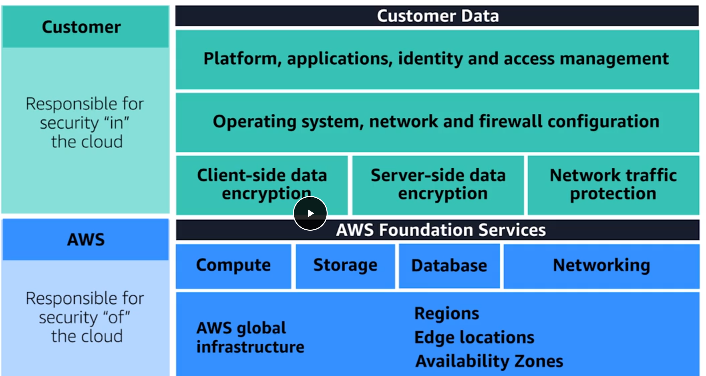
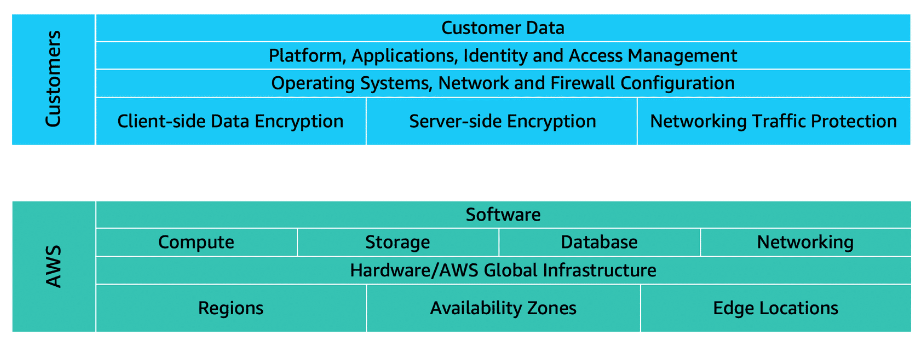
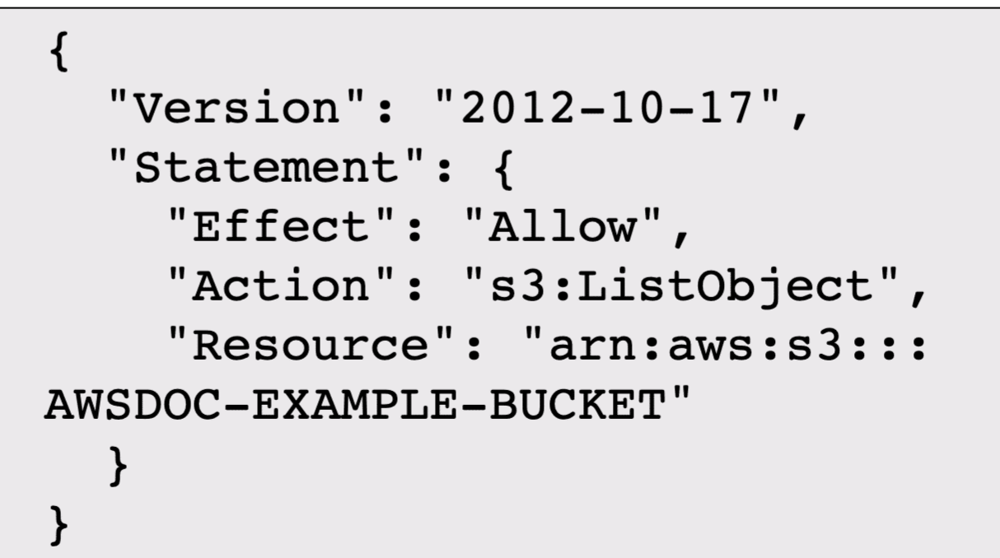

Customers: Security in the cloud<br>
Customers are responsible for the security of everything that they create and put in the AWS Cloud.




AWS is responsible for security of the cloud.
  Physical security of data centers
  Hardware and software infrastructure
  Network infrastructure
  Virtualization infrastructure

Access control in a granular way by using the AWS service, AWS Identity and Access Management, or IAM. 

#### IAM Users
IAM Users are created. By default an IAM user has no permissions. They are given certain specific permissions.

After users are created they are assigned IAM policy.

#### IAM policy 
is a JSON document that describes what API calls a user can or cannot make.
> Effect : Allow/deny
> Action : api call.
> Resource: resource regarding the api call.(like a bucket name or something)

#### IAM groups. 
  ```
  Easier to manage users & their permissions.
  Attach a policy to a group and all of the users in that group will have those permissions.
  ```
#### IAM Roles 
  ```
  Identities in AWS that are called roles. 
  Have associated permissions that allow or deny specific actions. These can be assumed for temporary amounts of time.
  When a role is assigned, it abandons all of the previous permissions that it has and it assumes the permissions of that role.
  An IAM role is an identity that you can assume to gain temporary access to permissions.  
  ```

#### AWS Organizations. 
  ```
  Install order and to enforce who is allowed to perform certain functions in what account is to make use of an AWS services. 
  Manage all accounts centrally.
  Hierarchical groupings of your accounts to meet security, compliance, or budgetary needs.-> organizational units (OUs) 
  Centrally permission control by using service control policies (SCPs)
  ```

### AWS Artifact
  ```
  Every industry has some specific standards that need to be upheld, 
  and you will be audited or inspected to ensure that you have met those standards.
  example:  If you run healthcare applications in the US you will need to design your architectures to meet HIPAA.
  Access these documents is through this service.
    AWS Artifact Agreements, you can review, accept, and manage agreements for an individual account and for all your accounts in AWS Organizations
  AWS Artifact Reports provide compliance reports from third-party auditors. 
  ```

We have security groups and network access layer which by default protect us from ddos attacks.
elb is also scalable and wouldn't be prone to slowloris attach
aws shield.

### AWS Key Management Service (AWS KMS)
    To encrypt data at rest or in transit, keys are offered.

### Amazon Inspector
    Improves the security and compliance of applications by running automated security assessments.

### Amazon GuardDuty
    intelligent threat detection for your AWS infrastructure and resources
